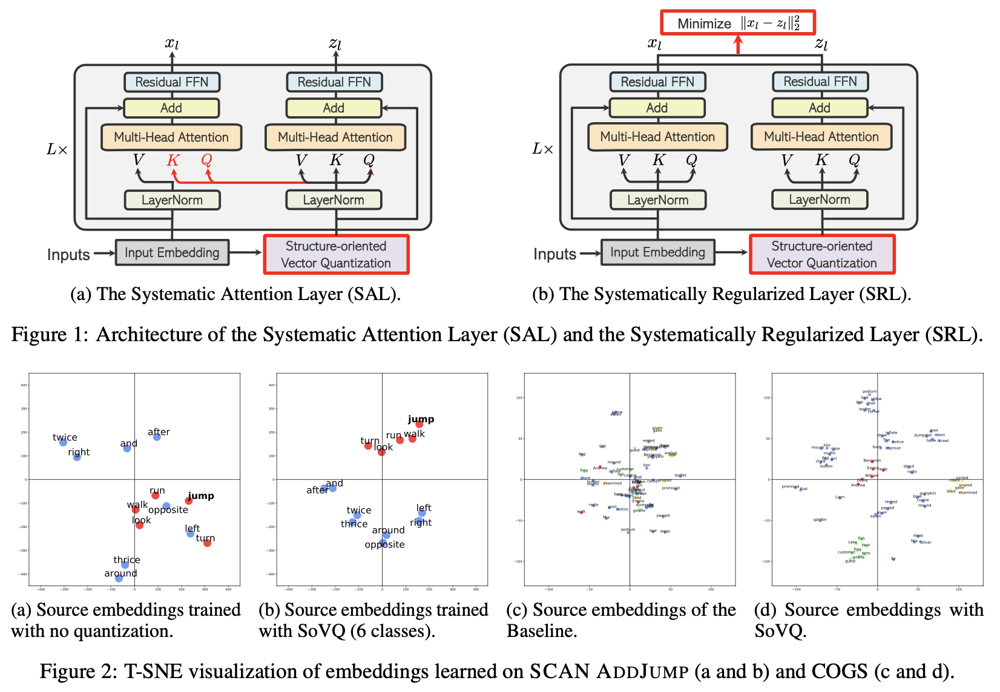

# [SQ-Transformer: Inducing Systematicity in Transformers by Attending to Structurally Quantized Embeddings]()
<hr>

This repo host the code for the paper [Inducing Systematicity in Transformers by Attending to Structurally Quantized Embeddings](), 
by [Yichen Jiang](https://jiang-yichen.io), [Xiang Zhou](https://owenzx.github.io/), and [Mohit Bansal](https://www.cs.unc.edu/~mbansal/).


## 0 Installation
This project is built on Python 3.6.8, pytorch 1.10.1 and fairseq 0.10.2. All dependencies can be installed via:

`pip install -r requirements.txt`

## 1 Running SQ-Transformer

### 1.1: Prepare Data
* In this work, we use the [SCAN](https://github.com/brendenlake/SCAN), [COGS](https://github.com/najoungkim/COGS), [CoGnition](https://github.com/yafuly/CoGnition), 
and WMT17 En-De, WMT14 En-Fr datasets to train and evaluate our models.

* The processed data binaries of SCAN, COGS, and CoGnition can be downloaded at this [Google Drive](https://drive.google.com/file/d/1hh3zCmfObd_6E8rtPcPOsP3gLe73JR2G/view?usp=sharing).
* Please follow [fairseq](https://github.com/facebookresearch/fairseq/blob/main/examples/translation/README.md) official 
documentation to process the WMT data.

#### The complete data directory structure should be:
```
SQ-Transformer/
├── data
    ├── scan_jump_x2_v2_1000prim/
        ├── dict.src.txt  
        ├── dict.tgt.txt  
        ├── test.src-tgt.src.bin  
        ├── test.src-tgt.tgt.idx   
        ├── train.src-tgt.tgt.bin 
        ├── valid.src-tgt.src.idx
        ├── test.src-tgt.src.idx  
        ├── train.src-tgt.src.bin  
        ├── train.src-tgt.tgt.idx  
        ├── valid.src-tgt.tgt.bin
        ├── preprocess.log  
        ├── test.src-tgt.tgt.bin  
        ├── train.src-tgt.src.idx  
        ├── valid.src-tgt.src.bin  
        └── valid.src-tgt.tgt.idx
    ├── scan_around_right/
        ├── dict.src.txt  
        ├── dict.tgt.txt  
        ├── test.src-tgt.src.bin  
        ├── test.src-tgt.tgt.idx   
        ├── train.src-tgt.tgt.bin 
        ├── valid.src-tgt.src.idx
        ├── test.src-tgt.src.idx  
        ├── train.src-tgt.src.bin  
        ├── train.src-tgt.tgt.idx  
        ├── valid.src-tgt.tgt.bin
        ├── preprocess.log  
        ├── test.src-tgt.tgt.bin  
        ├── train.src-tgt.src.idx  
        ├── valid.src-tgt.src.bin  
        └── valid.src-tgt.tgt.idx
    ├── cogs/
        ├── dict.src.txt  
        ├── dict.tgt.txt  
        ├── test.src-tgt.src.bin  
        ├── test.src-tgt.tgt.idx   
        ├── train.src-tgt.tgt.bin 
        ├── valid.src-tgt.src.idx
        ├── test.src-tgt.src.idx  
        ├── train.src-tgt.src.bin  
        ├── train.src-tgt.tgt.idx  
        ├── valid.src-tgt.tgt.bin
        ├── preprocess.log  
        ├── test.src-tgt.tgt.bin  
        ├── train.src-tgt.src.idx  
        ├── valid.src-tgt.src.bin  
        └── valid.src-tgt.tgt.idx
    ├── cognition_cg/
        ├── dict.en.txt  
        ├── dict.zh.txt  
        ├── preprocess.log  
        ├── test.en-zh.en  
        ├── test.en-zh.zh  
        ├── train.en-zh.en  
        ├── train.en-zh.zh  
        ├── valid.en-zh.en  
        └── valid.en-zh.zh
    ├── wmt14_en_fr/
    └── wmt17_en_de
├── raw_data
    ├── cognition
        ├── cg-test  
            ├── cg-test.compound  
            ├── cg-test.en  
            ├── cg-test.zh  
            ├── NP  
            ├── PP  
            └── VP
        ├── processed  
        ├── test.en  
        ├── test.zh  
        ├── train.en  
        ├── train.zh  
        ├── valid.en  
        └── valid.zh
```

### 1.2: Train the SQ-Transformer
* To train on SCAN AddJump 2x (augmented), run ```./train_scripts/train_vq_seq2seq_scan_jump.sh```.
* To train on SCAN AroundRight, run ```./train_scripts/train_vq_seq2seq_scan_aroundright.sh```.
* To train on COGS, run ```./train_scripts/train_vq_seq2seq_cogs.sh```.
* To train on CoGnition, run ```./train_scripts/train_vq_seq2seq_cognition.sh```.

### 1.3: Evaluate the SQ-Transformer
* To evaluate on SCAN AddJump 2x (augmented), run ```./eval_scripts/eval_vq_seq2seq_scan_jump.sh```.
* To evaluate on SCAN AroundRight, run ```./eval_scripts/eval_vq_seq2seq_scan_aroundright.sh```.
* To evaluate on COGS, run ```./eval_scripts/eval_vq_seq2seq_cogs.sh```.
* To evaluate on CoGnition, run ```./eval_scripts/eval_vq_seq2seq_cognition.sh```.

## Citation
```
@article{jiang2024SQTransformer,
  title={Inducing Systematicity in Transformers by Attending to Structurally Quantized Embeddings},
  author={Jiang, Yichen and Zhou, Xiang and Bansal, Mohit},
  journal={},
  year={2024}
}
```